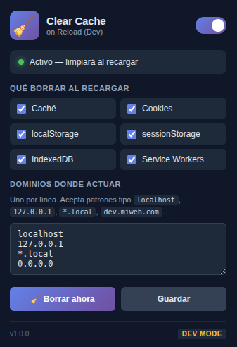

# 🧹 Clear Cache on Reload

> Extensión de Chrome / Edge / Brave que **borra automáticamente la caché del sitio actual** cada vez que recargas la página. Ideal para desarrollo web, pruebas de despliegues y depuración de assets cacheados.


---

## ✨ Características

- 🔄 **Limpieza automática** de caché al recargar la pestaña activa.
- 🎯 **Por sitio (origen)**: solo borra los datos del dominio en el que estás, no toca el resto.
- 🎛️ **Activar / desactivar** desde el popup con un toggle.
- 🧠 **Recuerda tu preferencia** entre sesiones (`chrome.storage.sync`).
- ⚡ **Manifest V3** (service worker, sin código remoto).
- 🪶 **Ligera**: ~18 KB empaquetada, cero dependencias externas.
- 🔒 **Privacidad total**: no envía datos a ningún servidor.

---

## 📸 Captura

<p align="center">
  
</p>

---

## 🚀 Instalación

### Opción 1 — Desde el código fuente (modo desarrollador)

1. Clona el repositorio:
   ```bash
   git clone https://github.com/EsdrasMujica/clear-cache-on-reload.git
   ```
2. Abre `chrome://extensions/` en tu navegador.
3. Activa el **Modo de desarrollador** (esquina superior derecha).
4. Pulsa **Cargar extensión sin empaquetar** y selecciona la carpeta del repo.
5. ¡Listo! El icono aparecerá en la barra de extensiones.

### Opción 2 — Instalar desde CRX (archivo compilado)

1. Descarga o genera el archivo `.crx` (ver [RELEASE](https://github.com/EsdrasMujica/clear-cache-on-reload/releases)).
2. Abre `chrome://extensions/` en tu navegador.
3. Arrastra y suelta el archivo `.crx` en la página.
4. Confirma la instalación cuando se te pida.
5. ¡Listo! La extensión se instalará automáticamente.

> **Nota**: Este método es ideal para distribución manual o testing de versiones compiladas.

### Opción 3 — Chrome Web Store

_Próximamente._

---

## 🖱️ Uso

1. Haz clic en el icono de la extensión.
2. Activa el toggle **"Limpiar caché al recargar"**.
3. Recarga cualquier página (`F5` / `Ctrl+R`).
4. La caché de ese sitio se borra **antes** de que la página vuelva a cargarse.

Cuando la opción está activa, verás un punto verde en el popup. Si está desactivada, la extensión no toca nada.

---

## 🔐 Permisos solicitados

| Permiso | Por qué se usa |
|---|---|
| `browsingData` | Para borrar la caché del sitio actual. |
| `tabs` | Para detectar la pestaña activa y su URL. |
| `webNavigation` | Para interceptar el evento de recarga antes de que el navegador pida los recursos. |
| `storage` | Para recordar si tienes la opción activa o no. |
| `host_permissions: <all_urls>` | Necesario para que `browsingData` pueda limpiar por origen en cualquier sitio. |

> No se recopila, almacena ni envía ningún dato fuera de tu navegador.

---

## 🛠️ Estructura del proyecto

```
clear-cache-on-reload/
├── manifest.json          # Configuración MV3
├── background.js          # Service worker (escucha recargas y borra caché)
├── popup.html             # UI del popup
├── popup.css              # Estilos del popup
├── popup.js               # Lógica del toggle
├── icons/
│   ├── icon16.png
│   ├── icon48.png
│   └── icon128.png
└── README.md
```

---

## 🧑‍💻 Desarrollo

### Requisitos
- Chrome / Edge / Brave actualizado.
- Editor de texto (VS Code recomendado).

### Flujo de trabajo
1. Edita los archivos.
2. Ve a `chrome://extensions/` y pulsa el icono de **recargar** en la tarjeta de la extensión.
3. Si tocaste el `popup.*`, cierra y vuelve a abrir el popup.
4. Si tocaste `background.js`, mira los logs en **"service worker"** dentro de la tarjeta de la extensión.

### Empaquetar para distribución

```bash
# ZIP (para Chrome Web Store)
zip -r clear-cache-on-reload-v1.0.0.zip . -x "*.DS_Store" "*.git*"

# CRX (firmado, para distribución manual)
google-chrome --pack-extension=./extension-clear-cache-dev
```

---

## ❓ FAQ

**¿Borra mis cookies o mi historial?**
No. Solo limpia la **caché** del sitio activo. Cookies, contraseñas, historial y localStorage **no se tocan**.

**¿Funciona en Firefox?**
No por ahora. Manifest V3 en Firefox aún tiene diferencias con `browsingData`. PRs bienvenidas.

**¿Ralentiza la navegación?**
No. La limpieza solo se ejecuta cuando detecta una recarga, y solo del origen actual.

**¿Puedo excluir ciertos sitios?**
Aún no. Está en el roadmap.

---

## 🗺️ Roadmap

- [ ] Lista blanca / lista negra de dominios.
- [ ] Modo "borrar también cookies y storage" (opcional).
- [ ] Atajo de teclado configurable.
- [ ] Soporte para Firefox.
- [ ] Traducción a inglés y otros idiomas.

---

## 🤝 Contribuir

1. Haz un fork.
2. Crea una rama: `git checkout -b feature/mi-mejora`.
3. Commit: `git commit -m "feat: añade X"`.
4. Push: `git push origin feature/mi-mejora`.
5. Abre un Pull Request.

---

## 📄 Licencia

MIT © 2026 — Esdras Mujica

Consulta el archivo [LICENSE](LICENSE) para más detalles.

---

<p align="center">
  Hecho con ☕ y mucha caché borrada.
</p>
